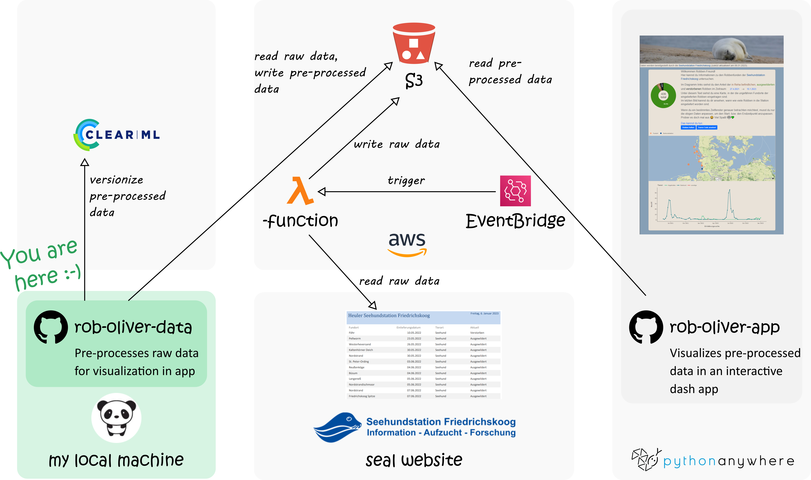
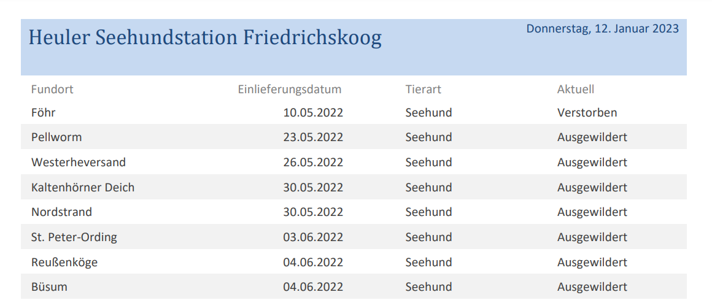

# rob-oliver-data


**Figure 1**: Architecture of the [rob-oliver-data](https://github.com/MirjamKirchner/rob-oliver-data) and
[rob-oliver-app](https://github.com/MirjamKirchner/rob-oliver-app) project

### Table of contents
- [Introduction](#introduction)
- [Pre-processing procedure](#pre-processing-procedure)
- [Quick start](#quick-start)
- [Learning resources](#learning-resources)

## Introduction
This repository is part of a pet project in which I visualize data about the animal admittances to the [Seehundstation
Friedrichskoog](https://www.seehundstation-friedrichskoog.de/en/) - a seal rescue station in the North of Germany.
If you are interested in learning about the data pre-processing procedure, stay here. If you are more curious about the
visualization of the pre-processed data in an interactive dashboard, please go to the repository
[rob-oliver-app](https://github.com/MirjamKirchner/rob-oliver-app).

In the following, I'll briefly talk you through the [Pre-processing procedure](#pre-processing-procedure) and the
related services (e.g., from [Amazon Web Services](https://aws.amazon.com/) (AWS)). Next, I'll give you a
[Quick start](#quick-start), in case you would like to try some of the described functionality on your local machine.
Finally, I've summarized the most important [Learning resources](#learning-resources) that helped me throughout the
implementation of this project. I hope, this will give you a head start if you would like to build something similar
yourself. Happy reading!

## Pre-processing procedure
In this section, we walk through the pre-processing procedure that transforms information about seal admissions from a
portable-document-format (PDF) file into a comma-separated-value (CSV) file.

### 1. Understanding the raw data

**Figure 2**: Excerpt of an example of a PDF-file that serves as raw data to our pre-processing procedure

The [Seehundstation Friedrichskoog](https://www.seehundstation-friedrichskoog.de/en/) provides
information about seal admissions to their station on their
[website](https://www.seehundstation-friedrichskoog.de/wp-content/heuler/1.6HomepageHeuler.pdf) in PDF. In Figure 2, we
see an excerpt of an example of such a file. It contains four features:

- **Fundort** (: finding place): The name of the place the admitted animal was found. Note that this is merely a rough
location that, if you look it up on a map, may be surprisingly far away from the water.
- **Einlieferungsdatum** (: admission date): The date the animal was admitted to the rescue station.
- **Tierart** (: breed): The breed of the admitted animal in {Seehund: harbor seal, Kegelrobbe: gray seal, sonstige:
other}.
- **Aktuell** (: status): The current status of the admitted animal in {Reha: in rehabilitation, Ausgewildert: released,
Verstorben: deceased}.

A particular challenge in this project was to update the status for each admitted animal over
time without having access to an explicit identifier (ID) in the raw data. In any other professional project, I would
advise you to argue for an ID in your data. However, in this case, I didn't have any strong leverage on how the rescue
station provides their data and, thus, simply had to work with it.

### 2. Scraping the raw data
To not miss any updates of the raw data, I've set up an automated job on AWS that regularly checks the seal website for
a new PDF file (see Figure 1).

To be precise, I use the [EventBridge](https://aws.amazon.com/eventbridge/) service to
trigger a [lambda](https://aws.amazon.com/lambda/) function on a set schedule: Mondays and Thursdays at 03.00 o'clock
(coordinated universal time). I deem this sufficiently frequent because the raw PDF file described in *1. Understanding
the raw data* is updated on an irregular basis, as the frequency of animal admissions depends on the pupping seasons of
the breeds in the area. Furthermore,  even during high season (Summer for harbor seals and Winter for gray seals), I've
observed that the PDF is rarely updated more frequently than twice a week.

The [lambda](https://aws.amazon.com/lambda/) function compares the PDF file currently available on the
[seal website](https://www.seehundstation-friedrichskoog.de/wp-content/heuler/1.6HomepageHeuler.pdf) with the already
existing files in an [S3](https://aws.amazon.com/s3/) bucket. If the PDF file already exists, the
[lambda](https://aws.amazon.com/lambda/) function aborts and does nothing. Otherwise, the PDF file is saved to the
[S3](https://aws.amazon.com/s3/) bucket and a descriptive change log is created for the file.

### 3. Pre-processing the raw data
During the pre-processing, we add the following features to the features in the raw data (see *1. Understanding the raw
data*):
- **Sys_id**: A unique identifier of an admitted animal that allows us to track its  status (: Aktuell).
- **Lat**: The latitude geographic coordinate of the finding place (: Fundort).
- **Long**: The longitude geographic coordinate of the finding place (: Fundort).
- **Erstellt_am** (: creation timestamp): The timestamp when the raw PDF file of this data point was created.
- **Sys_aktualisiert_am** (: update timestamp): The timestamp when the data point was created in the pre-processed
data set.
- **Sys_hash**: A hash value for historicization purposes, i.e., this hash value allows us to track when there have
been any changes for a specific Sys_id, e.g., when their status (: Aktuell) has changed from Reha (: in rehabilitation)
to Ausgewildert (: released).

From looking at the architecture depicted in Figure 1, you might wonder why the pre-processing step to calculate the
features above does not run on AWS but on my local machine. The reason behind it is that identifying the geographic
coordinates of a finding place is currently not 100 % reliable and, therefore, not fully automated. Instead, there is a
manual review step before I upload the pre-processed data in to the [S3](https://aws.amazon.com/s3/) bucket, and to
[ClearML](https://clear.ml/). Here, I use [ClearML](https://clear.ml/) for versioning my data sets, meaning that if
there are any errors in the uploaded data sets, I can quickly recover to one of their earlier
[versions](https://clear.ml/docs/latest/docs/hyperdatasets/dataset/) on ClearML. Note, that this
[functionality](https://docs.aws.amazon.com/AmazonS3/latest/userguide/Versioning.html) can also be provided by the
[S3](https://aws.amazon.com/s3/) directly, and that I used [ClearML](https://clear.ml/) primarily to gain a better
understanding fo their services.

## Quick start
I assume you have Python 3.8+ installed on your local machine.

1. Clone this repository, e.g., by running the following command in your shell:
```
git clone https://github.com/MirjamKirchner/rob-oliver-data.git
```
2. On your local machine, create a virtual environment in the ``rob-oliver-data`` repository and activate it, either by
using the Python integrated development environment (IDE) of your choice (such as
[PyCharm](https://www.jetbrains.com/pycharm/) or [Visual Studio Code](https://code.visualstudio.com/)), or by following
the instructions [here](https://realpython.com/python-virtual-environments-a-primer/).


3. With your virtual environment being active, install the packages specified in the ``requirements.txt`` file,
e.g., by executing the following command in your shell:
```
pip install -r requirements.txt
```

4. Create a folder `./data/out`. This is the location where the result files of the pre-processing procedure will be
saved to.

5. To try out the functionalities described section [Pre-processing procedure](#pre-processing-procedure),
you may execute the code under the name-main idiom in  `./src/RobHistoricizer.py` with `historicizer_class = "local"`.
Note that running the code below with `historicizer_class = "aws"` will throw an error as you do not have any write
access to the [S3](https://aws.amazon.com/s3/) bucket where the data is stored. If you want to gain a detailed
understanding of how the pre-processing procedure is implemented, I recommend you to start with function `update_rob()`
in class `RobHistoricizer(ABC)` and work your way forwards from there.

```
if __name__ == "__main__":
    historicizer_class = ["aws", "local"][1]
    if historicizer_class == "aws":
        rob_historicizer = RobHistoricizerAWS()
    elif historicizer_class == "local":
        rob_historicizer = RobHistoricizerLocal()
    else:
        raise ValueError(
            f"Invalid `historicizer_class` {historicizer_class}. Choose in `['aws', 'local']`."
        )
    rob_historicizer.update_rob()
```


## Learning resources
**AWS**
- [lambda](https://aws.amazon.com/lambda/) function
  - [Deploying Python code in lamda function](https://aws.amazon.com/premiumsupport/knowledge-center/lambda-python-package-compatible/)
  - [Give a lambda function access to an S3 bucket](https://repost.aws/knowledge-center/lambda-execution-role-s3-bucket)
- [Giving public read access to an S3 bucket](https://bobbyhadz.com/blog/aws-s3-allow-public-read-access)
- [Execute a lambda function on a schedule with EventBridge](https://docs.aws.amazon.com/eventbridge/latest/userguide/eb-run-lambda-schedule.html)
  - [Helper to get the cron schedule expression right](https://crontab.guru/#0_3)
- [Helper to get AWS policies right](https://awspolicygen.s3.amazonaws.com/policygen.html)

**ClearML**
- [ClearML](https://clear.ml/) data sets:
  - [Docs](https://clear.ml/docs/latest/docs/references/sdk/dataset)
  - [YouTube tutorial](https://youtu.be/S2pz9jn26uI)